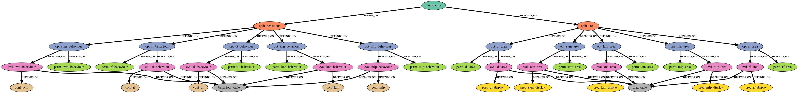
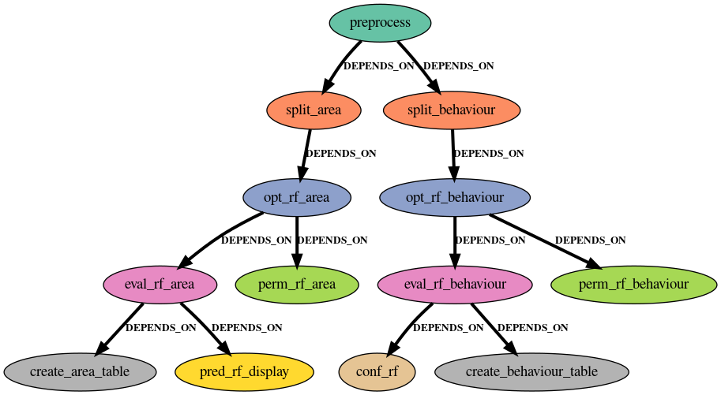

# Fire Prediction Workflow

This is a supervised machine learning workflow orchestrated by BEE that predicts fire behaviour and burned area. It includes preprocessing, data splitting, model optimization, evaluation, and reporting. This workflow is inspired by the work described in the paper, [Explainable machine learning approaches for understanding fire outcomes](https://www.spiedigitallibrary.org/conference-proceedings-of-spie/12675/1267515/Explainable-machine-learning-approaches-for-understanding-fire-outcomes/10.1117/12.2677931.full?webSyncID=0cbad059-329a-d883-c9d9-02bc9993ced2&sessionGUID=68bead49-a285-31ab-0d3a-6b03c97c009b).

## Workflow DAGs


*DAG of the tasks produced by firebee.py*



*DAG of the tasks produced by rf_only_firebee.py*

## Important Outputs

- Trained models: `models/`
- Metrics summary table: `metrics/area/area_metrics_summary.csv` or `metrics/behaviour/behaviour_metrics_summary.csv`
- Displays:
  - Regression errors: `metrics/area/displays/`
  - Confusion matrices: `metrics/behaviour/displays/`
- Feature importance: `metrics/area/features/` or `metrics/behaviour/features/`

## Running the Workflow

To run this example, do the following:

```
mkdir ~/workdir # you must follow this exactly or change the paths in line 30 of the Dockerfile.fire_analysis
cp -r . ~/workdir
cd ~/workdir
python firebee.py # or rf_only_firebee.py to run the random forest only example
beeflow submit firebee fire-workflow/ fire-workflow/fire-workflow.cwl fire-workflow/fire-workflow.yml .
```

## Workflow Components:

- firebee.py uses BEE's CWL API to create the cwl and yaml file for the workflow
- rf_only_firebee.py is the same as firebee.py, but the workflow only uses random forest models. This workflow is much faster and takes up less nodes.
- fire-workflow/preprocess.py drops unwanted columns, encodes specified columns, and outputs the encoder in the models directory. The cleaned data is  data/data.csv.
- fire-workflow/split_data.py splits data into training and testing sets into the data directory.
- fire-workflow/optimize_models.py searches for the best the best combination of given hyperparameters for a given model and outputs the best fit model into the models directory.
- fire-metrics/eval_models.py runs given evaluation metrics on a model and outputs a json of those metrics into a given directory. The metrics for this example are found [here](https://scikit-learn.org/stable/api/sklearn.metrics.html) in the Classification metrics section and the Regression metrics section.
- fire-workflow/create_tables.py creates a table summary for the metric data created by eval_models.py. **the output is currently a csv located in metrics/area or metrics/behaviour**
- fire-workflow/pred_display.py creates a [visualization of the prediction error of a regression model](https://scikit-learn.org/stable/modules/generated/sklearn.metrics.PredictionErrorDisplay.html#sklearn.metrics.PredictionErrorDisplay). The output is located in metrics/area/displays.
- fire-workflow/confusion_matrix_maker.py [creates a confusion matrix based on true and predicted values](https://scikit-learn.org/stable/modules/generated/sklearn.metrics.ConfusionMatrixDisplay.html#sklearn.metrics.ConfusionMatrixDisplay.from_predictions). The output is located in metrics/behaviour/displays. 
- fire-workflow/feature_perm.py creates a csv and a plot for the [permutation feature importance](https://scikit-learn.org/stable/auto_examples/ensemble/plot_forest_importances.html#feature-importance-based-on-feature-permutation). The output is located in metrics/(area or behaviour)/features

## Customizing Your Workflow

This workflow was written in a way such that it can easily be applied to other supervised machine learning problems! Edit firebee.py or any other workflow components to fit your needs.
