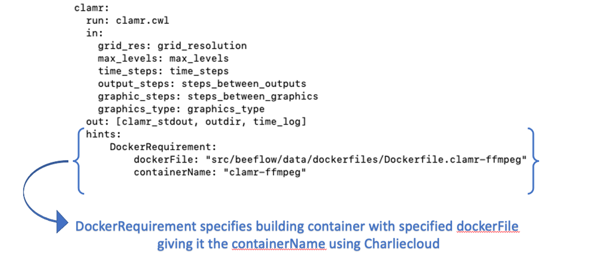

Getting Started - Example Workflow
**********************************

If you have beeflow installed and the components running you are ready to try out a BEE workflow.

CLAMR workflow
==============
`CLAMR <https://github.com/lanl/CLAMR>`_ is an open source LANL mini-app that simulates shallow water equations. CLAMR performs hydrodynamic cell-based adaptive mesh refinement (AMR).

The CLAMR workflow we introduce here is a simple two step workflow that runs a CLAMR simulation (step one) that produces graphic images from periodic time steps, then makes a movie using FFMPEG (step two) to visualize the progression of the simulation. We use this workflow for some of our integration tests and thought it a practical example to help you start with your first workflow. The workflow is in **examples/clamr-ffmpeg-example.tgz**. You may want to untar the file (in examples directory ``tar xvf clamr-ffmpeg-example.tgz``) to explore the cwl files that specify what will be run. Below is the clamr-step with the DockerRequirement in hints that specifies to build a container from a dockerfile using Charliecloud (the container runtime specified in the configuration file).

clamr step in clamr_wf.cwl
--------------------------------------------

Submit the CLAMR workflow on the same front end, where you started the components (to start the components of beeflow, see Installation Guide).

.. code-block::

    bee_client submit example example/clamr-ffmpeg-example.tgz clamr_wf.cwl clamr_job.yml

Output:

.. code-block::

   Workflow submitted! Your workflow id is fce80d.

Start workflow using the workflow id from the output:

.. code-block::

    bee_client start fce80d

Output:

.. code-block::

    Started workflow!

If this is the first time you've run the workflow it will build the container and create a Charliecloud image tarball. This process will be done before running the workflow tasks as jobs and may take a few minutes. The first task will be in the ready state, until the container is built. This is the pre-processing building phase and will only be performed once. In this example both steps use the container that is built in the pre-processing stage. Once the build has been completed the Charlicloud image will be in the container archive location specified in the builder section of the bee configuration file. You can list contents of the configuration file using ``bee_cfg list``. The status of the workflow will progress to completion and can be queried as shown:

Check the status:

.. code-block::

    bee_client query fce80d

Output:

.. code-block::

    Running
    clamr--READY
    ffmpeg--WAITING

Check the status:

.. code-block::

    bee_client query fce80d

Output:

.. code-block::

    Running
    clamr--RUNNING
    ffmpeg--WAITING

When completed:

.. code-block::

    bee_client query fce80d

Output:

.. code-block::

    Archived
    clamr--COMPLETED
    ffmpeg--COMPLETED

The archived workflow with associated standard job outputs will be in the **bee_workdir** see the default section of your configuration file (to list configuration file contents run ``bee_cfg list``). This workflow also produces output from CLAMR and ffmpeg in your home directory:

.. code-block::

    graphics_output - a directory containing the graphics png files.
    total_executuion_time.log
    CLAMR_movie.mp4 - The final movie

The other outputs are in the archive of the workflow.

This example uses Charliecloud. The image will still be in the Charliecloud cache. You can list what is in the cache using ``ch-image list``.  If there are no other builds, the result should be:

.. code-block::

    ch-image list

.. code-block::

    clamr-ffmpeg
    debian:stable-slim

There are other commands for resetting (clearing out all images) and deleting an image. Type ``ch-image --help`` for more information.

