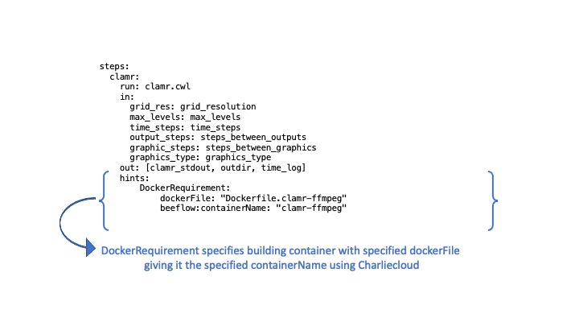

Getting Started - Example Workflows
***********************************

If you have beeflow installed and the components running you are ready to try
out a BEE workflow.

CLAMR workflow examples
=======================
`CLAMR <https://github.com/lanl/CLAMR>`_ is an open source LANL mini-app that
simulates shallow water equations. CLAMR performs hydrodynamic cell-based
adaptive mesh refinement (AMR).

The CLAMR workflow examples we introduce here are simple two step workflows
that run a CLAMR simulation in step one, producing graphic images from periodic
time steps. Then FFMPEG is run in step two to make a movie visualizing the
progression of the simulation. We use these workflows for some of our
integration tests and they are practical examples to help you start using BEE.
The differences in the clamr workflows are the way the containers are used.

    - **CLAMR build workflow** the container will be built
    - **CLAMR copy workflow**, the container will be copied from a specified path to the container_archive directory (specified in bee.conf)
    - **CLAMR use workflow** uses the container specified

CLAMR build workflow
--------------------
The workflow is in **examples/clamr-ffmpeg-build**. You may want to explore the
cwl files to understand the workflow specification for the example. Below is
the clamr-step with the DockerRequirement in hints that specifies to build a
container from a dockerfile using Charliecloud (the container runtime specified
in the configuration file).

CWL for clamr step in examples/clamr-ffmpeg-build/clamr_wf.cwl

Submit the CLAMR workflow from the top level directory of the repository (BEE),
on the same front-end where you started the components (to start the components
of beeflow, see Installation Guide).

.. code-block::

    bee_client package examples/clamr-ffmpeg-build .
    bee_client submit clamr-example clamr-ffmpeg-build.tgz clamr_wf.cwl clamr_job.yml

Output:

.. code-block::

   Workflow submitted! Your workflow id is fce80d.

Start workflow using the workflow id from the output:

.. code-block::

    bee_client start fce80d # use the actual workflow id

Output:

.. code-block::

    Started workflow!

If this is the first time you've run the workflow it will build the container
and create a Charliecloud image tarball. This process will be done before
running the workflow tasks as jobs and may take a few minutes. The first task
will be in the ready state, until the container is built. This is the
pre-processing building phase and will only be performed once. In this example
both steps use the container that is built in the pre-processing stage. Once
the build has been completed the Charliecloud image will be in the container
archive location specified in the builder section of the bee configuration
file. You can list contents of the configuration file using ``bee_cfg list``.
The status of the workflow will progress to completion and can be queried as
shown:

Check the status:

.. code-block::

    bee_client query fce80d

Output:

.. code-block::

    Running
    clamr--READY
    ffmpeg--WAITING

Check the status:

.. code-block::

    bee_client query fce80d

Output:

.. code-block::

    Running
    clamr--RUNNING
    ffmpeg--WAITING

When completed:

.. code-block::

    bee_client query fce80d

Output:

.. code-block::

    Archived
    clamr--COMPLETED
    ffmpeg--COMPLETED

The archived workflow with associated standard job outputs will be in the
**bee_workdir** see the default section of your configuration file (to list
configuration file contents run ``bee_cfg list``). This workflow also produces
output from CLAMR and ffmpeg in your home directory:

.. code-block::

    graphics_output - a directory containing the graphics png files.
    total_execution_time.log - log generated by Clamr
    CLAMR_movie.mp4 - The final movie

The other outputs are in the archive of the workflow.

This example uses Charliecloud. The image will still be in the Charliecloud
cache. You can list what is in the cache using ``ch-image list``.  If there are
no other builds, the result should be:

.. code-block::

    ch-image list

.. code-block::

    clamr-ffmpeg
    debian:stable-slim

There are other commands for resetting (clearing out all images) and deleting
an image. Type ``ch-image --help`` more information consult the `Charliecloud
documentation <https://hpc.github.io/charliecloud/>`_.

CLAMR copy workflow
--------------------
Add LANL example here copying /usr/projects/BEE/clamr/clamr-toss ...

CLAMR use workflow
--------------------
Add LANL example here using /usr/projects/BEE/clamr/clamr-toss ...

cat-grep-tar workflow
---------------------

The cat-grep-tar workflow is a rather simple workflow that demonstrates BEE's
ability to work with multiple tasks, including those that can run at the same
time. The first step, or task, does a simple ``cat`` of an input file. The
stdout of this step is then passed as a file to two steps that ``grep`` for
different words within the text. These can both be run in parallel. The final
step takes the output files from the grep step and stores these into a tarball.

These input values are stored in a YAML file within the workflow directory. As
an example we have a default ``input.yml`` file that can be used. It contains:

.. code-block::

    input_file: lorem.txt
    word0: Vivamus
    word1: pulvinar
    tarball_fname: out.tgz

This uses a sample from the classic Lorem Ipsum text and does a grep for two
random words in the file. Finally an output tarball is generated with the name
``out.tgz``.

Before running, make sure to take a look at the CWL files that form the
workflow.  There is a main ``workflow.cwl`` file that stores the worfklow,
specifies inputs and outputs and lists all of the workflow steps or tasks. Note
that each of these steps specifies their step-specific inputs and outputs, as
well as a ``run`` option, that in this case points to the CWL file that
contains further information about how to execute the command. When creating a
workflow, you will need to create a similar workflow structure, explicitly list
dependencies between steps and also describe how to run the steps on the
system. For more information on writing a workflow please refer to the
`Common Workflow Language User Guide`_, but note that BEE doesn't currently
support all features.

.. _Common Workflow Language User Guide: https://www.commonwl.org/user_guide/

To run our simple example here, you'll want to first create a workdir for the
workflow and copy over the input file ``lorem.txt``. I'll refer to this path in
code samples as ``$WORKDIR_PATH``. Note that this is separate from the
directory containing the workflow itself, which contains all the CWL files and
the input YAML files. The workdir is where all of your input files should be
stored before starting a workflow, as this will be the current working directoy
of all steps that are run. Output from each step will also be stored here.

Once this workdir has been created and beeflow has been started, you are now
ready to package and submit the workflow. This can be done with the following
sequence of commands:

.. code-block::

    bee_client package examples/cat-grep-tar . # Tars up the workflow
    bee_client submit $NAME ./cat-grep-tar.tgz workflow.cwl input.yml $WORKDIR_PATH # Now submit the workflow

This first command packages the workflow into a tarball, which makes it easy to
pass everything over to the Workflow Manager and finally submits the workflow,
specifying a name, the tarball path, the location of the CWL file, the yaml
file and finally the workflow path containing lorem.txt. If you copy and paste
make sure to change $NAME to a name of your choice and $WORKDIR_PATH to the
proper path that was created ealier. The submit command should have produced a
short ID of 6-7 characters.

The workflow has now been submitted, however nothing is happening yet. To start
the workflow, you'll need to issue a start command along with the workflow
ID:

.. code-block::

    bee_client start $ID

Now the workflow should start up. While the workflow is running you can check
the status by running a ``bee_client query $ID``. On completion, each step
should be in a ``COMPLETED`` state.

After all steps have finished, you should see a number of files that have been
created in your $WORKDIR_PATH:

.. code-block::

    cat.txt
    lorem.txt
    occur0.txt
    occur1.txt
    out.tgz

The ``cat.txt`` file is just a duplicate of ``lorem.txt``. The ``occur0.txt``
and ``occur1.txt`` files were produced respectively by the ``grep0`` and
``grep1`` steps.  ``out.tgz`` was produced by the final tar step. For this
example, the cat step and the tar steps are not really necessary, since the
file already exists in the input directory and on completion you don't
necessarily need to have both of the ``occur*.txt`` files in a tarball. However,
this is a useful sample of the features a real-world workflow might need to
use.  For instance, the first step might be producing some sort of output from
a calculation, instead of just copying the input to the output. The last step
may also do some more processing to produce some sort of final file. If
necessary, there can many more processing steps than this simple example shows.
