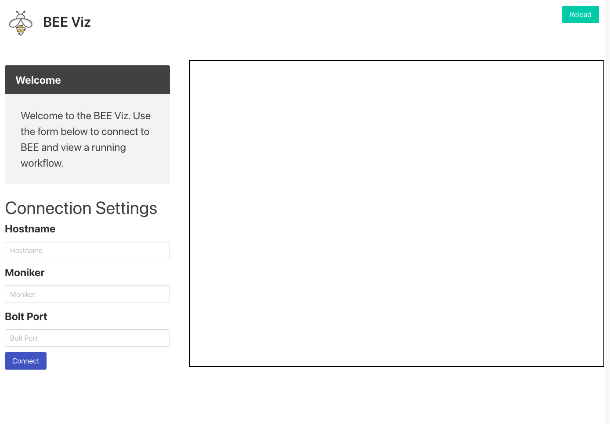

Workflow Visualization
**********************

BEE includes a simple visualization tool for viewing BEE workflows locally.
This can be installed on a local macOS or Linux-based system using the
JavaScript package manager ``npm``. We plan to make a binary release of this in
the future for ease of use.

Before attempting to use this tool, you'll need to have BEE running on a
cluster you have SSH access to from your local machine. Submit a workflow and
record the workflow ID, or simply keep track of the ID of an already submitted
workflow.

**IMPORTANT**: the version of BEE on the cluster must be the same as the
visualization tool installed locally.

Installation
============

First, get an updated clone of the BEE repository, or grab a release tarball
matching the version you have installed on the cluster. Install ``npm``
following their `installation guide`_. This should be easy to do using your
distro's package manager, or using brew on macOS.

.. _installation guide: https://docs.npmjs.com/downloading-and-installing-node-js-and-npm

Making sure that you're in the ``beeflow/enhanced_client`` directory, you can
then install everything with ``npm install``. If your local machine is
connected to a VPN or uses a proxy, you may need to temporarily disable it.
Also take a look at the README in that directory if you need more information.

Running
=======

From the frontend where BEE has been launched, you need to run ``beeclient
metadata ${WF_ID}``, where ``WF_ID`` is the ID of a submitted workflow. You can
safely ignore all the information displayed here, except for the ``bolt_port``
option which will be needed later.

On your local machine, given that everything is installed, you can now run
``npm start``, all in the same ``beeflow/enhanced_client`` directory. This will
show a screen that looks like this:

Along the left-hand side you'll see a form containing three fields. Fill in the
the hostname and moniker for the given frontend that BEE is running on (it must
be the exact frontend, otherwise this will fail). Then enter the bolt port
value that should have been saved earlier. Click connect and after a few
seconds the right-hand window should populate with a workflow visual.

If any error boxes appear, check your connection and VPN set up. It's possible
that something may be blocking the visual client from connecting to BEE. The
way this currently works is by opening up an SSH tunnel to the frontend on
which BEE is running; if you're able to SSH to that frontend from the same
local machine, then the BEE visualization tool should also be able to.
