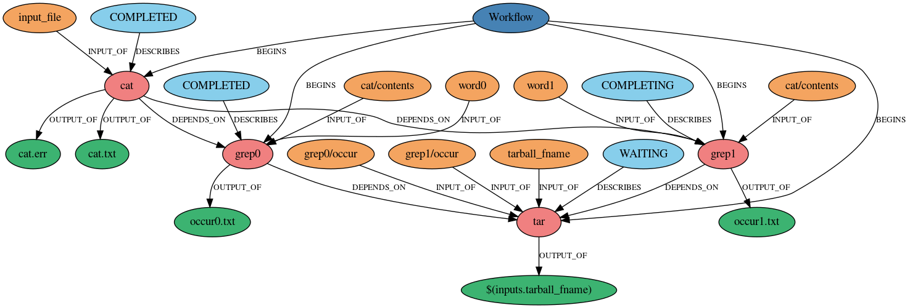

Workflow Visualization
**********************

BEE includes a simple command for viewing BEE workflows. By using the ``beeflow
dag $ID`` command, you can view the directed acyclic graph (DAG) of any submitted
workflow.

**IMPORTANT**: To use this command, change the neo4j image in your bee config to
the neo4j-dag.tar.gz in the beedev directory.

Creating DAGs
=============

The dag command can be run at any point of the workflow, and can
be run multiple times. To see the DAG of a workflow before it runs, submit
the workflow with the ``--no-start`` flag and then use the dag command. The
DAGs are exported in PNG format to ~/.beeflow/dags. They follow the naming
convention '{wf_id}.png'

Example DAG
===========

The DAG below was created by running the dag command while the cat-grep-tar
example workflow was running.

The orange bubbles are inputs, the blue bubbles are task states, the red
bubbles are tasks, and the green bubbles are outputs. The graph is in a
hierarchical format, meaning that tasks that are higher up in the graph
run before the ones below them.
